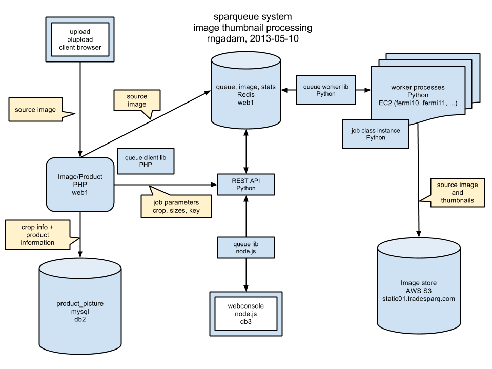
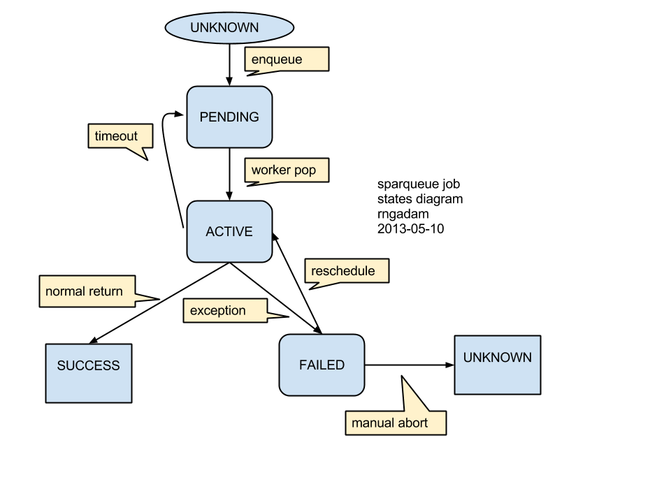

# Sparqueue

## What is it?

Yet another job processing queue with distributed workers. We try to borrow as
many architectural elements from past and current systems but with the following
philosophy:

* simplicity: try to minimize the size of the codebase and dependencies
* fast: in-memory datastore, singleton job loading
* cross-language job submit: all configuration as JSON objects
* high-level, mature scripting language: Python
* built to support workers/jobs in other languages

## Installation

requisites (system-wide):

```
sudo pip install virtualenv
```

setup:

```
virtualenv env
```

activate the environment:

```
. env/bin/activate
```

Dependencies install:

```
pip install -r requirements.txt
```

Installing to self:

```
pip install .
```

Using current package (useful when having edit-run-debug cycles):


```
export PYTHONPATH=.
```

## Philosophy

Because of limited resources, we limit requirements and assume that:

* jobs are well-behaved
 * they will not crash the worker
 * does not leak memory
 * clean up after themselves
* users can be trusted
 * will not try to do nefarious things to the system
 * separate mechanism for authentication

This means:

* no ACL (except at the ssh login level)
* no job process isolation (except at the worker level)
* no forking of jobs (jobs are in the same memory space)
* single centralized job datastore (with single replica)

We also won't hesitate to use cutting edge features of the Linux kernel and
operating system (systemd).


## Things to think about

* memory use
* datastore use
* exception handling and error reporting
* job progress report and worker logging

More:

* As requirements grow, configuration tend to turn into their own horrible
scripting languages... We don't want that.
* Code deployment is a major challenge: both versioning and getting the dependencies.
* Important to have accessible visibility in all aspects of workers and jobs; statistics, progress, resource usage, logs, etc.
* We need automated testing before going to production to ensure that we can safely refactor the code without introducing breaking changes.
* As jobs multiplies, its related data multiplies. We need log "rotation" in Redis

## Features

### http JSON API

Allows other languages (such as PHP) submit jobs without having to access the
underlying datastore by simply constructing a valid JSON request.

## Guide

### system diagram



### job state diagram



### ids

id embeds useful information for worker and job:

* workerid: hostname.pid.seconds.millis
 * time is worker start time
* jobid: hostname.pid.seconds.millis.process-counter
 * time is job creation time

### worker states

states:

* IDLE: has no jobs
* PROCESSING: has a job
* STALE: last update greater than 60s]

## redis

### data structures and keys hierarchies

Redis data structures (hierarchy is joined by | separator):

* [system name]: configurable ex: system-test, system-rngadam)
 * queues
  * workers: hash of workerid => timestamp of last dequeue attempt
  * jobs: a hash of jobid => JSON configuration
   * class: the name of the class to use
   * metadata
    * jobid
    * queue scheduled in
    * path to git repository of job source
    * git commit hash of job source
   * vars
    * parameters to the job instance perform function
   * stats
    * system and job configurable processing stats
   * output
    * return from perform (usable as vars to next job in a workflow system)
  * [queue name]
   * all: a hash jobid => timestamp of jobs last popped from pending
   * pending: a queue (list) of jobid waiting for worker processing (pop)
   * failed: a set of jobid that have failed due to exception (ready for reschedule or abort)
   * success: a set of jobs that have finished successfully
 * workers:
  * current: hash of workerid => jobid

### key types:

$ redis-cli keys "sparqueue|*" | xargs -n1 --verbose redis-cli type
redis-cli type sparqueue|queues|main|success
set
redis-cli type sparqueue|queues|jobs
hash
redis-cli type sparqueue|workers|current
hash
redis-cli type sparqueue|queues|main|workers
hash
redis-cli type sparqueue|queues|main|cancelled
set

## Roadmap

### Management UI

We could start with a text console UI? or command-line parsing? This
facilitates access control (ssh) and let us more quickly develop the library to
query the underlying datastore.

### Workflow

We are planning to build a workflow on top of the job processing queue. This
will handle inter-job dependencies and work across queues to take advantage of
data locality.
